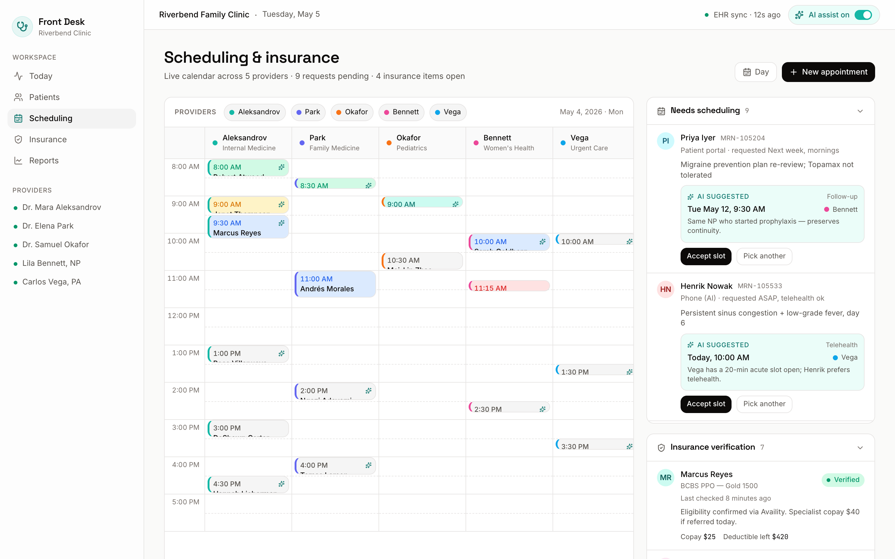
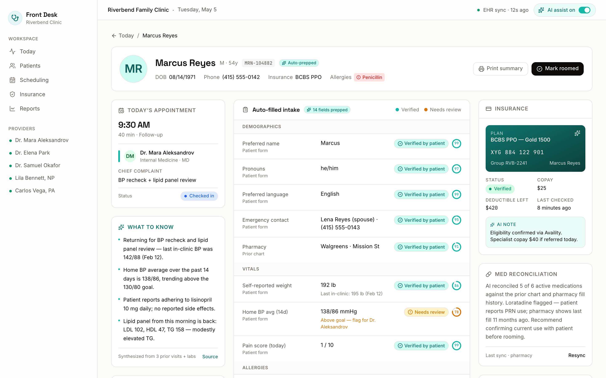
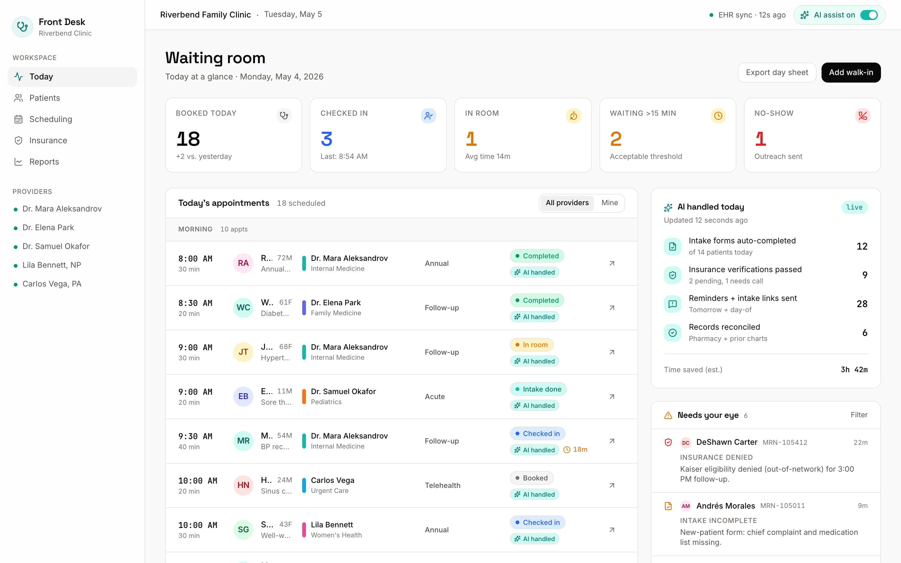

# Patient Front Desk

> AI receptionist for clinics — patient intake, scheduling, and insurance verification.


A density-first front-desk console for a primary-care clinic. Patient intake, scheduling, and insurance verification all sit in one workspace, with the AI assistant working in the margins — auto-completing forms, suggesting time slots that fit, drafting payer phone scripts when an eligibility check fails.

Designed in the spirit of Linear / Vercel / Stripe — a tool a front-desk lead can actually live in.

## Run locally

```bash
npm install
npm run dev
```

Open [http://localhost:3003](http://localhost:3003).

```bash
# production build
npm run build
npm start
```

## Routes

| Path | What it shows |
| --- | --- |
| `/` | Waiting-room dashboard — 5-stat ribbon, today's appointment list grouped morning/afternoon, AI-handled stats card, "Needs your eye" exception queue. |
| `/patient/[id]` | Patient detail — banner with allergies and primary insurance, today's appointment + AI summary on the left, auto-filled intake form with confidence rings + verification badges in the center, insurance card + medication reconciliation + action items on the right. |
| `/scheduling` | Time-blocked calendar (5 providers × 8am–6pm), provider switcher chips, plus a right-rail with two queues: "Needs scheduling" (AI-suggested slot + fit reason) and "Insurance verification" (status pill + AI-drafted phone script). |

## Stack

- **Next.js 15** (App Router, RSC, `generateStaticParams` for patient pages)
- **Tailwind CSS v4** with a minimal token system (`bg`, `bg-elev`, `border`, `text`, `text-mute`, `accent`, etc.)
- **Framer Motion** for stagger entrances and quiet card transitions
- **lucide-react** for line icons
- **TypeScript** end-to-end, no `any`, no `@ts-ignore`

`next/font` handles **Inter** (sans), **Space Grotesk** (display), **JetBrains Mono** (mono).

## Design tokens

Spacing is on a 4px rhythm (4–96). Radii: 6 / 10 / 16. Motion: 200–300 ms with `cubic-bezier(0.4, 0, 0.2, 1)`.

Accent: `#14b8a6`.

## Screenshots





## Notes

All data is seeded — no backend, no PHI. Names, MRNs, and plan IDs are fabricated. Clinical content is restricted to common, well-controlled conditions and standard medications, used to make the UI feel real, not to model decision support.
